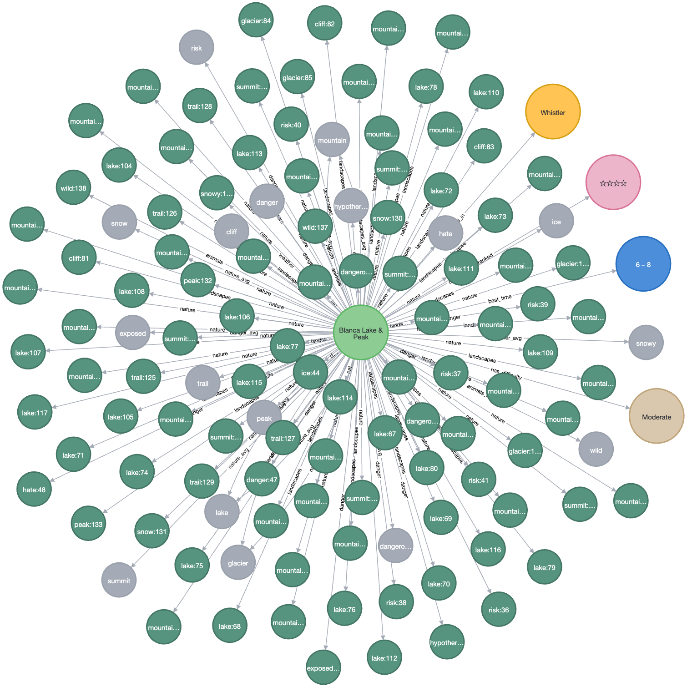
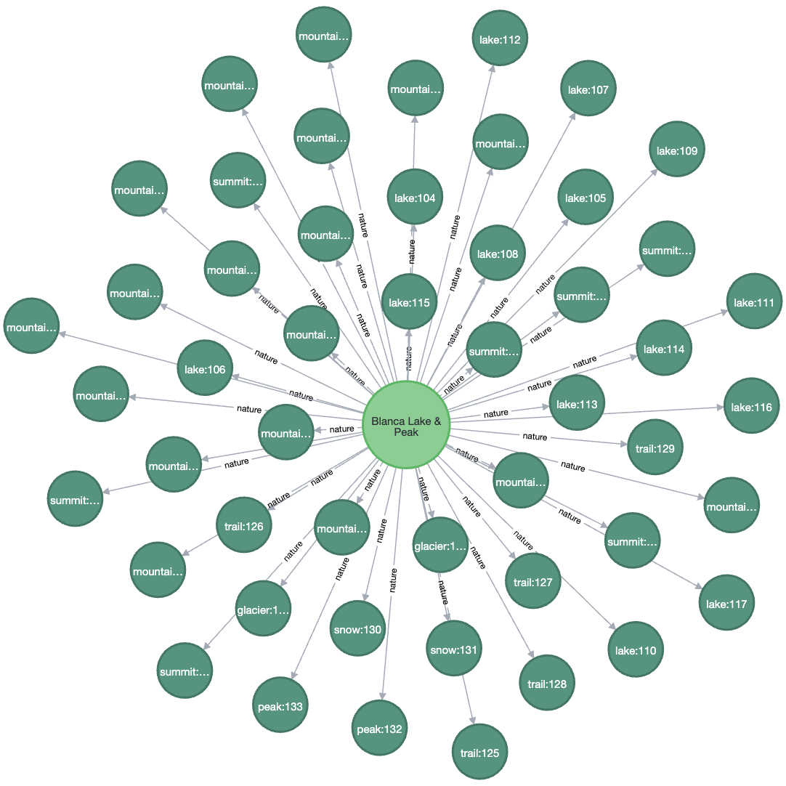
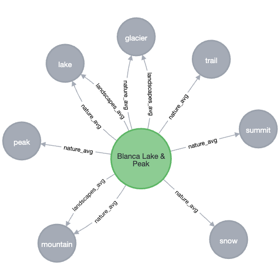
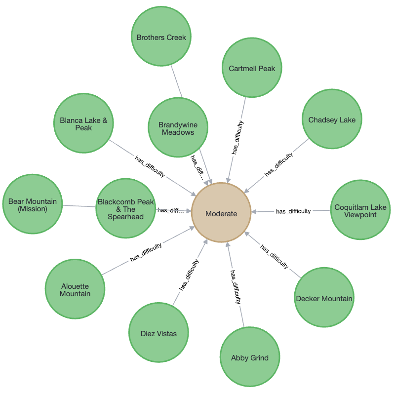
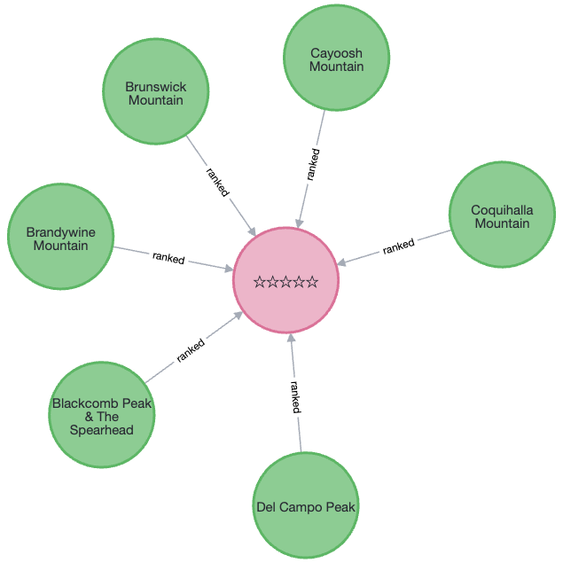
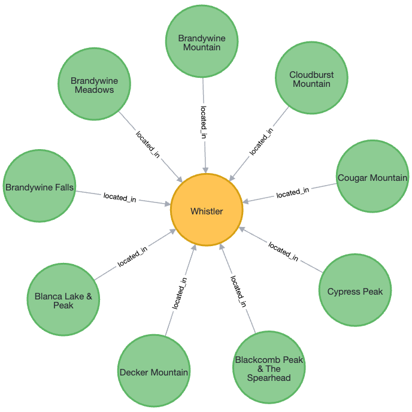
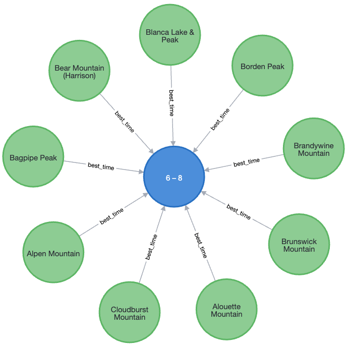
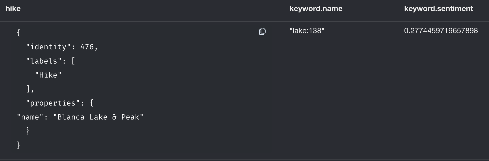
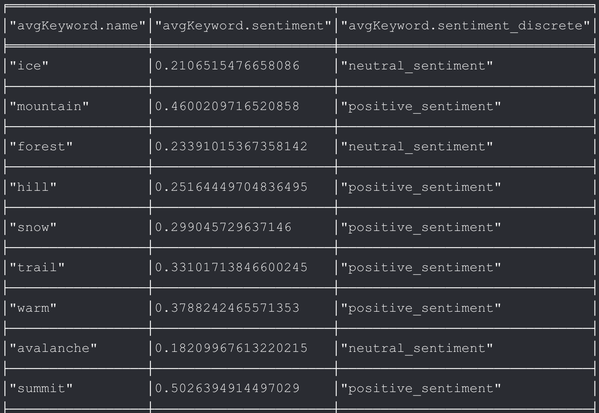
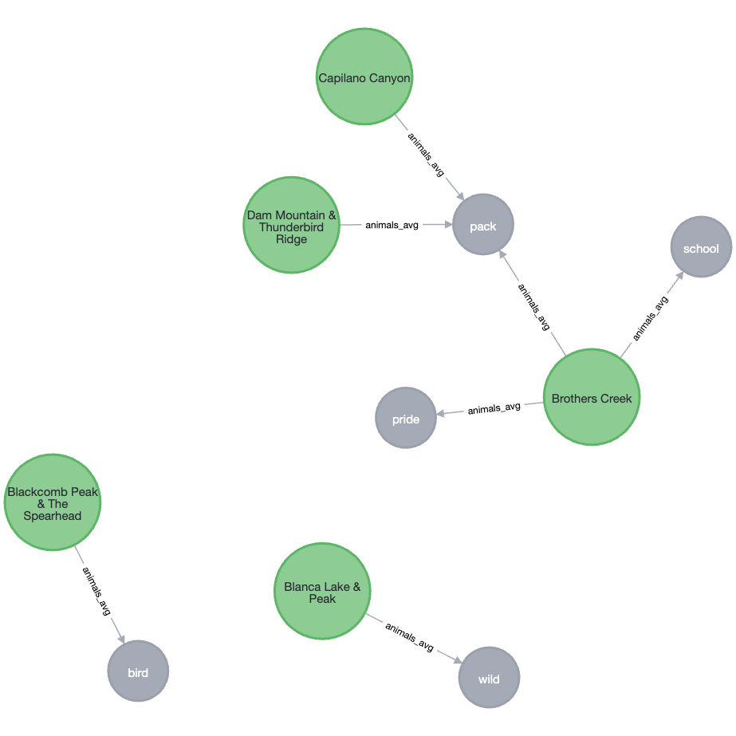

# FDE-Hike

- [Introduction](#introduction)
- [Data sources](#datasources)
- [Pipeline](#pipeline)
  - [Ingestion](#ingestion)
  - [Staging](#staging)
    - [Cleansing](#cleansing)
    - [Transformations](#transformations)
    - [Enrichments](#enrichments)
  - [Production](#production)
    - [Queries](#queries)
- [Project Submission Checklist](#project-submission-checklist)
- [How to Run?](#how-to-run)
  - [Automatic](#automatic)
  - [Manual](#manual)


## Introduction

We will be focused on hiking, analyzing the similarities between different routes. We will use information from specialized hiking sites and the Reddit API to enrich our data, including specific features such as geographic information and interesting details such as possible risks associated with each route. We will also employ natural language processing (NLP) techniques to extract valuable information from users' comments regarding their experience.

A graph database was used to establish relationships between routes, regions and features. This can help find similarities between routes and suggest alternatives based on user preferences.

Questions formulated:

1. Can we find user recommendations about a specific topic on a route?
2. What are the hiking routes with similar levels of difficulty?
3. Which are the hiking trails with a similar length?

## Data sources

For this project we utilize 2 datasources:

1. We used a website specialized in hinkings that provided information on different routes, [besthikesbc.ca](https://besthikesbc.ca/hike-database/), providing us with information such as:
    - Hike Name
    - Ranking
    - Difficulty
    - Distance (KM)
    - Elevation Gaom (M)
    - Gradient
    - Time (Hours)
    - Dogs
    - 4x4
    - Season
    - Region

2. We use Reddit publications for data enrichment. The Reddit API was accessed using the Python library called PRAW ([praw.readthedocs.io](https://praw.readthedocs.io/en/stable/)), providing us with information such as:

    - Title
    - Upvotes
    - Comments

On the other hand, we create ".csv" files that will help us to identify specific keywords, for the later use of these with Natural Language Processing (NLP) techniques in the Reddit comments.

- Animals.csv
- Danger.csv
- Landscapes.csv
- Nature.csv
- Structures.csv
- Weather.csv

## Pipeline

Insert image :)

### Ingestion

In this phase we take care of recovering the data from besthikesbc.ca, first of all we check by pinging Google to see if we have a connection. If the result is positive, we will extract the data to the mentioned page.

- We make an HTTP request to get the content of the page. Then, we employ the BeautifulSoup library to parse the HTML and extract information from the table of our interest.the table data is organized in a dictionary format and converted to JSON , we will save this JSON in a file named 'data_hiking.json' in a specific directory.

- The next step is to load the data from a JSON file named 'data_hiking.json' into a MongoDB collection, we check if a collection named 'hikes' already exists in the MongoDB database, if it does, we delete it to ensure an up-to-date data insertion.

In case the connection gives a negative result.

- We perform data loading with local records.

It is important to note that the lines related to the storage in a Redis database were removed since the use of this technology was not necessary for the work we are initially proposing, We also considered using the Postgres database but we decided that the database that best suited our needs was MongoDB since the information collected in it was only one table, so we preferred the use of a NoSQL,

### Staging

#### Cleansing

During the Cleansing process, we focused on determining which fields would be helpful in addressing the questions initially posed. As a result, columns such as:

  - Distance (KM)
  - Elevation Gaom (M)
  - Gradient
  - Dogs
  - 4x4
  - Season

#### Transformations
We also had the initiative to make transformations to certain fields (Ranking and Time (Hours)) but we decided that the initial form of the data gave a better understanding.

#### Enrichments
In this section, we make the most of the data collected from Reddit posts.

From our database in MongoDB, where we store information from pages specialized in hiking, we make a call to the Reddit API using the "Hike Name" field, thus obtaining the posts related to hiking.

Subsequently, we will use Natural Language Processing (NLP) techniques to identify the keywords of the different topics that interest us and the frequency with which they are found in various publications. Likewise, we will carry out a sentiment analysis corresponding to the comment in which the keyword was found.

### Production

The production graph database is structured in such a way that each hike is its own node. It can be connected to many of the following node types:

- **Difficulty** (Very Easy, Easy, Moderate, Difficult, Very Difficult): An expression of the difficulty of the hike.
- **Keyword**: Key words extracted by Natural Language Processing from Reddit posts. One hike can be connected to many keywords.
- **Ranking**: Ranges from 1 to 5 stars.
- **Region**: The region where the hike is located.
- **Time**: The best time of day to perform the hike.
- **Keyword_avg**

*Keyword* and *Keyword_avg* are the most interesting of these Nodes since, not only do they come from analyzing the posts, but they carry the sentiment of each post content and comments, creating a new node for each keyword found. It repeats if found more than once, as each one carries a sentiment. In the end, a pattern match is run to compute the average sentiment of one keyword's sentiment, creating new nodes called `{keyword}_avg` of type "Keyword_avg" to contribute to the final analysis of the graph.


#### Queries

## 1. Retrieve all Connected Nodes for a Hike:

```cypher
MATCH (hike:Hike {name: 'Blanca Lake & Peak'})-[*1]-(connectedNode)
RETURN hike, connectedNode;
```


This query retrieves all nodes connected to the 'Blanca Lake & Peak' hike, regardless of relationship type.

## 2. Retrieve Nodes Related to Nature for a Hike:
```cypher
MATCH (hike:Hike {name: 'Blanca Lake & Peak'})-[:nature]-(connectedNode)
RETURN hike, connectedNode;
```


This query retrieves nodes related to the 'Blanca Lake & Peak' hike specifically connected through the 'nature' relationship.
Note that every node has a sentiment attatched to it, ranging from -1 to 1. We've defined the boundaries to be the following
-1 to -0.25 : a negative sentiment
-0.25 to 0.25 : a neutral sentiment
0.25 to 1 : a positive sentiment

## 3. Retrieve Average Sentiment Nodes Related to Nature for a Hike:
```cypher
MATCH (hike:Hike {name: 'Blanca Lake & Peak'})-[:nature_avg]-(connectedNode)
RETURN hike, connectedNode;
```


This query retrieves nodes representing the average sentiment related to nature for the 'Blanca Lake & Peak' hike.
As one can observe, the landscape average relation is also present since the keywords sets overlap each other. 
This query cleans up the graph and gives concrete information about the sentiment of the elements in the hike.

## 4. Retrieve Hikes with Difficulty Level:

```cypher
MATCH (hike:Hike)-[:has_difficulty]->(difficulty:Difficulty)
WHERE difficulty.level = 'Moderate'
RETURN hike, difficulty;
```


This query retrieves hikes and their associated difficulty level.

## 5. Retrieve Hikes with a Specific Ranking:

```cypher
MATCH (hike:Hike)-[:ranked]->(ranking:Ranking)
WHERE ranking.value = "☆☆☆☆☆"
RETURN hike, ranking;
```


This query retrieves hikes with a specific ranking (5 stars in this example).

## 6. Retrieve Hikes in a Certain Region:

```cypher
MATCH (hike:Hike)-[:located_in]->(region:Region)
WHERE region.name = 'Whistler'
RETURN hike, region;
```


This query retrieves hikes located in a specific region (Pacific Northwest in this example). Adjust the region name accordingly.

## 7. Retrieve Hikes Suitable for a Specific Time:
```cypher
MATCH (hike:Hike)-[:best_time]->(time:Time)
WHERE time.hours = '6 – 8'
RETURN hike, time;
```


This query retrieves hikes recommended for a specific time of day (8-10 / Morning in this example). Modify the time name as needed.

## 8. Retrieve Keywords and Their Sentiment for a Hike:
```cypher
MATCH (hike:Hike {name: 'Blanca Lake & Peak'})-[:nature]->(keyword:Keyword)
RETURN hike, keyword.name, keyword.sentiment;
```


This query retrieves keywords and their sentiment for a specific hike ('Example Hike' in this example).

## 9. Retrieve Average Sentiment for All Keywords Across Hikes:
```cypher
MATCH (avgKeyword:Keyword_avg)
RETURN avgKeyword.name, avgKeyword.sentiment;
```


This query retrieves the average sentiment for all keywords across all hikes.

## 10. Retrieve Hikes with Overall Positive Sentiment on a certain topic:
```cypher
MATCH (hike:Hike)-[:animals_avg]->(avgKeyword:Keyword_avg)
WHERE avgKeyword.sentiment_discrete = 'positive_sentiment'
RETURN hike, avgKeyword;
```


This query retrieves hikes associated with keyword topics that have an overall positive sentiment.
In this case with the topic of animals. From this we can infer that the hike "Blackcomb Peak & The Spearhead" has birds and since
"birds" has an average sentiment of ~0.6 or, a "positive_sentiment", then we can safely assume that it is good for bird watching

### Project Submission Checklist

- [x] Repository with the code, well documented
- [x] Docker-compose file to run the environment
- [x] Detailed description of the various steps
- [x] Report with the project design steps divided per area
- [x] Example dataset: the project testing should work offline, i.e., you need to have some sample data points.
- [x] Slides for the project presentation. You can do them too in markdown too.

## How to run

Run the Docker daemon, then...

## Automatic startup
### MacOS / Linux 
```sh
./start.sh
```

If you get a permission error, check the current permissions of the start.sh script
```sh
ls -l start.sh
```

If the script doesn't have execute permissions, you can add them using the chmod command
```sh
chmod +x start.sh
```

You should then be able to run the initial command.

## Manual Startup (all)


Now edit or create an **.env** file like so
```
AIRFLOW_UID=


_AIRFLOW_WWW_USER_USERNAME=airflow
_AIRFLOW_WWW_USER_PASSWORD=airflow
AIRFLOW_GID=0
_PIP_ADDITIONAL_REQUIREMENTS=xlsx2csv==0.7.8 faker==8.12.1 praw==7.7.1
```
Make sure to fill in the missing AIRFLOW_UID value with your local user id `id -u`.


Run the following command to creat the volumes needed in order to send data to airflow:
```sh
mkdir -p ./dags ./logs ./plugins
```

And this **once**:
```sh
docker-compose up airflow-init
```
If the exit code is 0 then it's all good.

### Running

```sh
docker-compose up
```

After it is up, add a new connection:

* Name - postgres_default
* Conn type - postgres
* Host - localhost
* Port - 5432
* Database - airflow
* Username - airflow
* Password - airflow

```sh
docker-compose up -d --no-deps --build flask-app
```